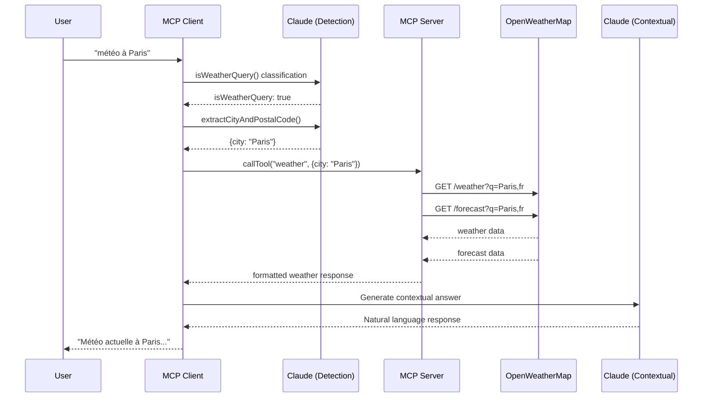
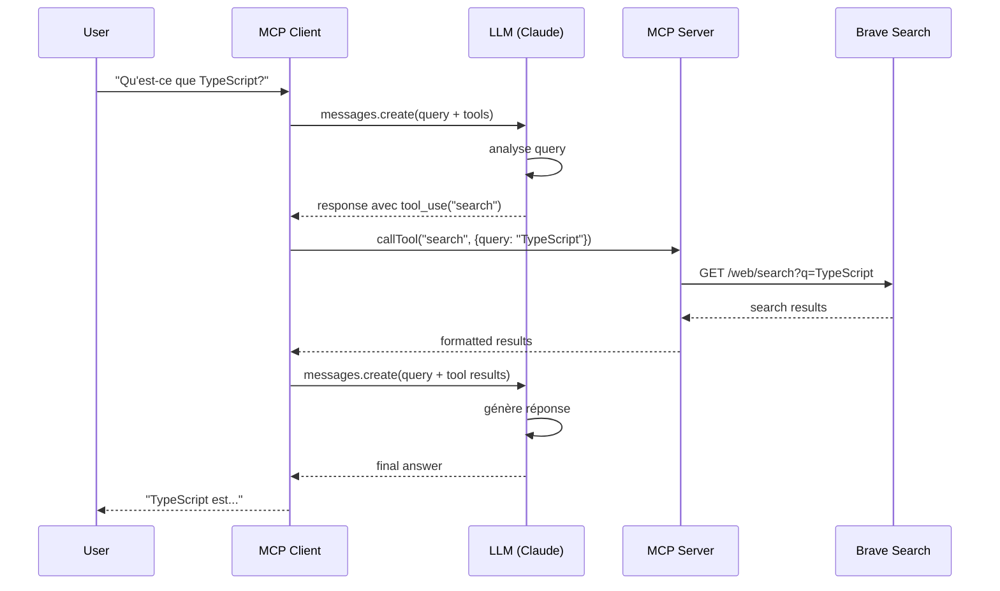
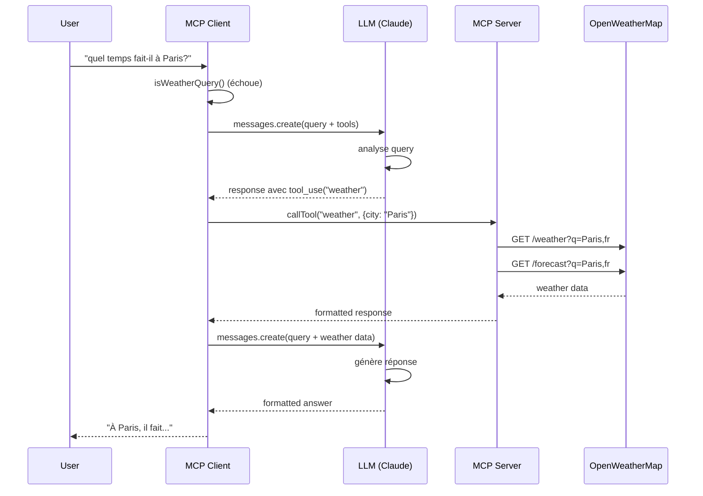
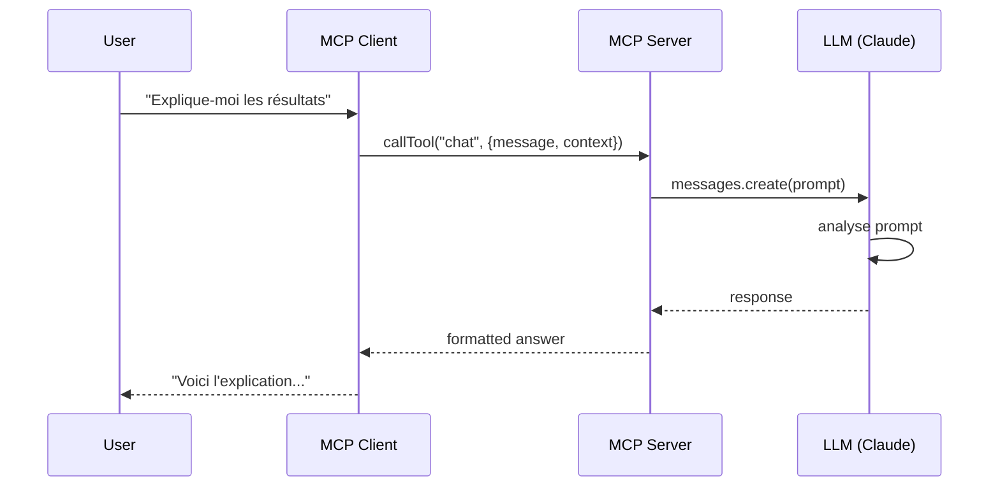
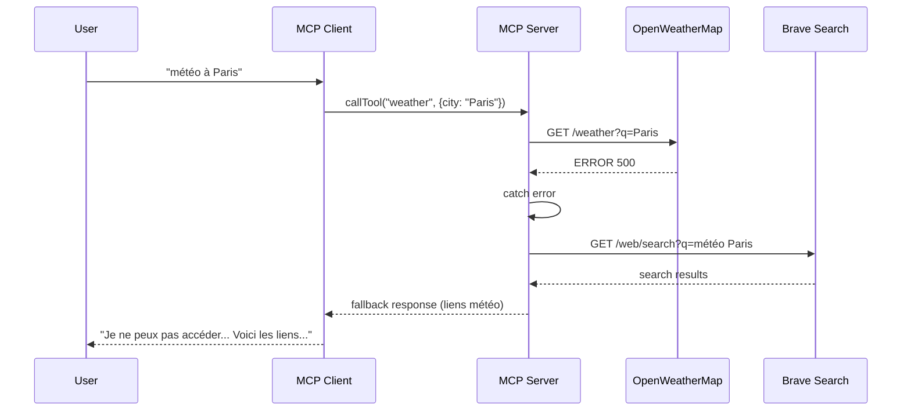
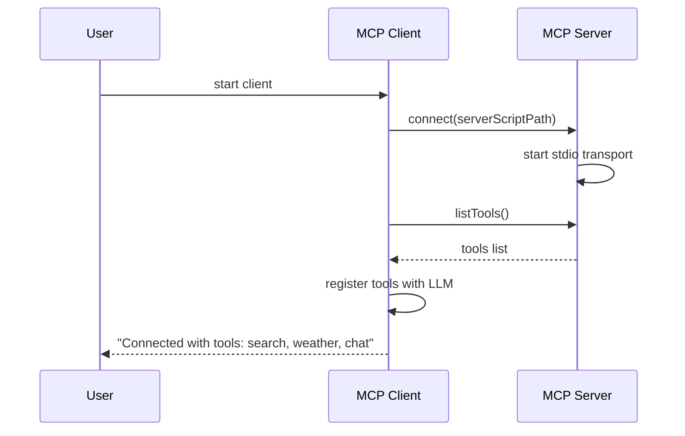
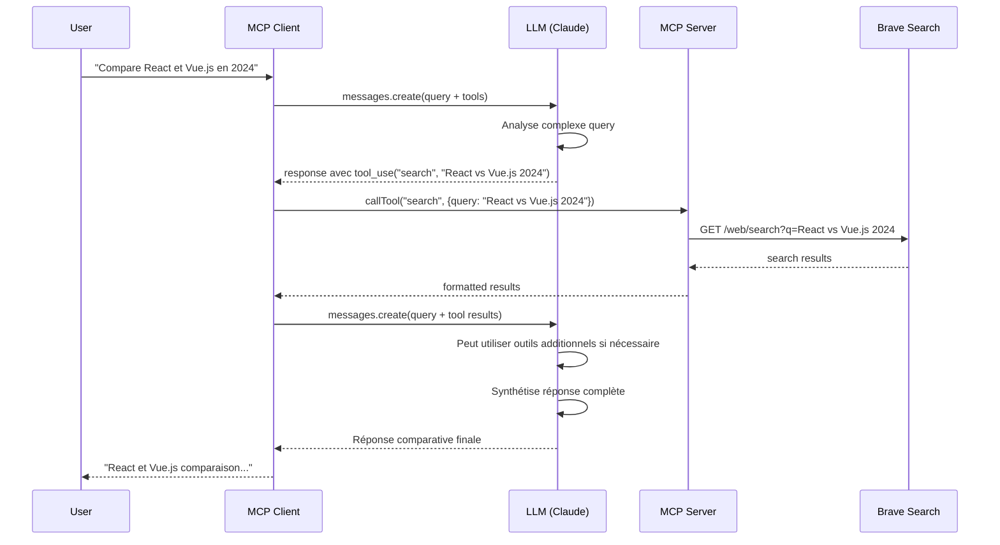

# Architecture et Diagrammes de Séquence

Ce document décrit l'architecture du système et les interactions entre les différents acteurs.

## Acteurs

- **User** : L'utilisateur final qui interagit avec le système
- **MCP Client** : Le client MCP qui gère l'interface utilisateur et orchestre les appels
- **LLM (Claude)** : Le modèle de langage Anthropic Claude
- **MCP Server** : Le serveur MCP qui expose les outils (search, weather, chat)
- **Brave Search** : L'API de recherche web Brave
- **OpenWeatherMap** : L'API météorologique

## Scénario 1 : Requête météo (détection directe par le client)

Dans ce scénario, le client détecte directement que c'est une requête météo et appelle l'outil sans passer par le LLM principal. La détection utilise Claude Haiku pour la classification, puis Claude génère une réponse contextuelle.

## Scénario 2 : Requête générale avec recherche (via LLM)

Dans ce scénario, le LLM décide d'utiliser l'outil de recherche.

## Scénario 3 : Requête météo via LLM (si détection échoue)

Si la détection météo du client échoue, le LLM peut quand même décider d'utiliser l'outil weather.

## Scénario 4 : Utilisation de l'outil chat (depuis le serveur)

L'outil `chat` peut être appelé directement depuis le serveur MCP (pas utilisé actuellement par le client).

## Scénario 5 : Fallback météo vers recherche

Si OpenWeatherMap échoue, le serveur fait un fallback vers Brave Search.

## Flux de connexion initial

## Scénario 6 : Requêtes complexes avec plusieurs outils

Claude peut décider d'utiliser plusieurs outils pour répondre à une question complexe.

## Points clés de l'architecture

1. **Double chemin pour les requêtes météo** :
   - Chemin direct : Client détecte → appelle directement l'outil weather
   - Chemin LLM : Client ne détecte pas → LLM décide d'utiliser l'outil weather

2. **Le LLM orchestre les outils** :
   - Le client expose les outils disponibles au LLM
   - Le LLM décide quels outils utiliser et dans quel ordre
   - Le LLM peut utiliser plusieurs outils en séquence pour des questions complexes

3. **Communication MCP via stdio** :
   - Le client et le serveur communiquent via standard input/output
   - Le transport stdio permet une communication bidirectionnelle

4. **Fallback automatique** :
   - Si OpenWeatherMap échoue, le serveur fait automatiquement un fallback vers Brave Search

5. **Trois instances Claude** :
   - Une dans le client pour la détection météo (Claude Haiku - rapide et économique)
   - Une dans le client pour orchestrer les outils (Claude Sonnet - intelligent)
   - Une dans le serveur pour l'outil chat (si utilisé)

6. **Logs de débogage** :
   - Le client affiche les requêtes JSON complètes envoyées à Claude pour la détection météo
   - Les logs incluent le modèle utilisé, les tokens max, et le payload complet
   - Utile pour comprendre le flux d'exécution et déboguer les problèmes
