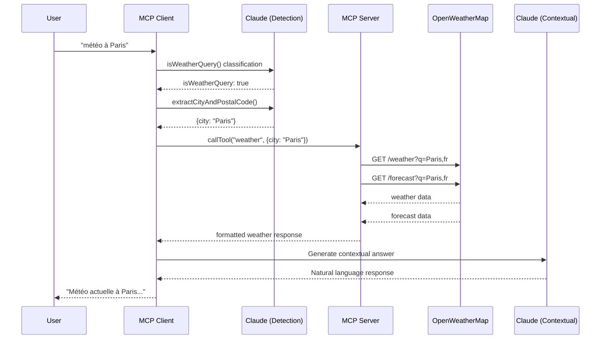
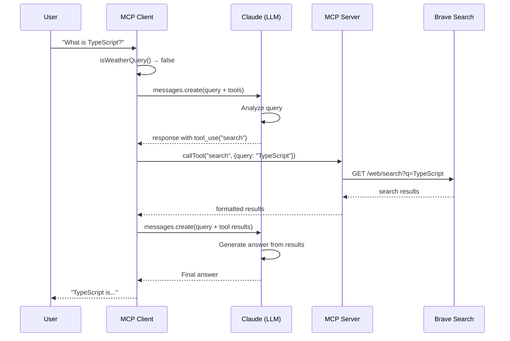
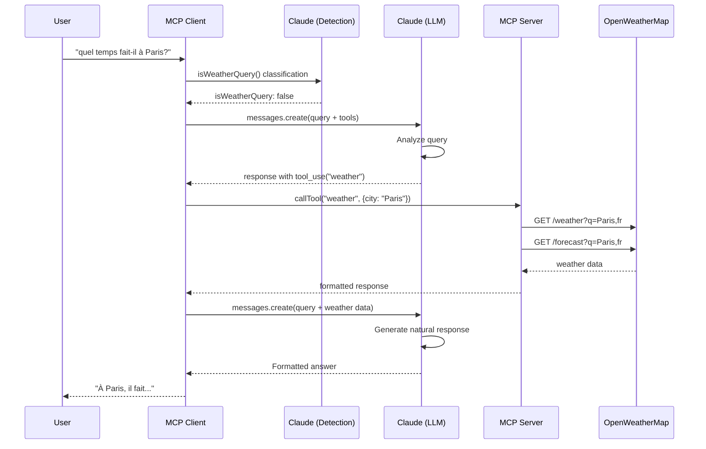
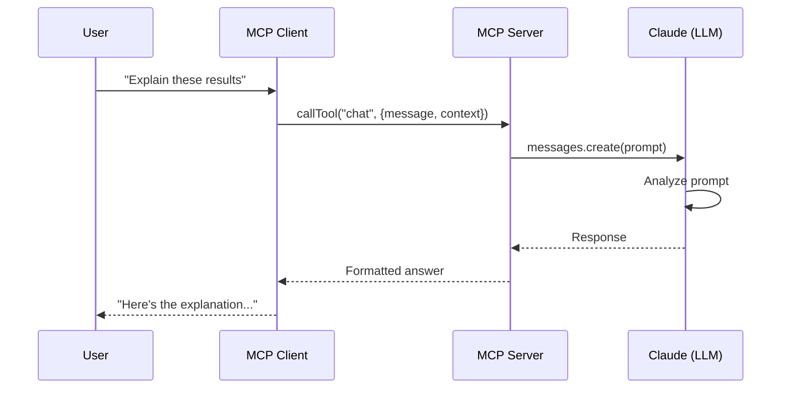
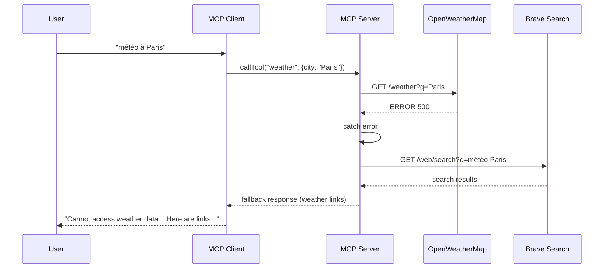
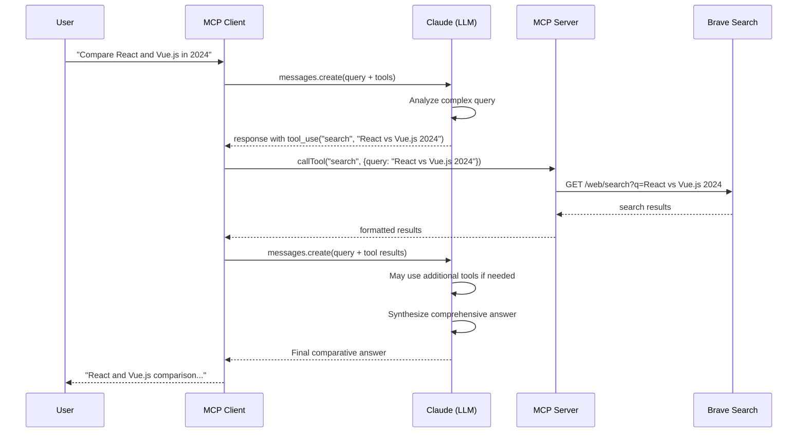

# MCP Server with Brave Search and Anthropic Claude

This project is a **custom Model Context Protocol (MCP) server** that exposes two main custom tools: **Brave Search** for web search and **Weather** for weather forecasts, integrated with Anthropic Claude for intelligent orchestration and response generation.

## 🏗️ Architecture Overview

This application implements a **single MCP server** that provides **custom MCP tools**:

1. **`search` tool** - A custom MCP tool that integrates with the Brave Search API
2. **`weather` tool** - A custom MCP tool that integrates with the OpenWeatherMap API
3. **`chat` tool** - A tool that uses Claude for contextual responses

The MCP client uses Claude (LLM) to intelligently decide which tools to use based on user queries, creating a seamless conversational experience.

## Features

- 🔍 **Custom `search` MCP tool** - Web search via Brave Search API
- 🌤️ **Custom `weather` MCP tool** - Weather forecasts via OpenWeatherMap API
- 🤖 **Intelligent orchestration** - Claude 3 Sonnet decides which tools to use
- 🌐 **MCP-compliant server** - Standard Model Context Protocol implementation
- 💬 **Conversational interface** - Natural language queries with automatic tool selection
- ⚙️ **Configurable** - All settings via environment variables
- 🛡️ **Robust error handling** - Automatic fallback mechanisms (weather → search)
- 🐛 **Debug logging** - Complete JSON request logging for weather detection and tool calls

## How It Works

This application demonstrates the power of **custom MCP tools**:

1. **Single MCP Server** (`mcpServer.ts`) exposes multiple custom tools
2. **MCP Client** (`mcpClient.ts`) connects to the server and exposes tools to Claude
3. **Claude Haiku** (fast, economical) classifies weather queries and extracts location information
4. **Claude Sonnet** (intelligent) analyzes user queries and intelligently selects which custom tools to use
5. **Custom Tools** execute their specific functionality (search, weather) and return results
6. **Claude Sonnet** synthesizes the tool results into natural language responses
7. **Debug Logs** show complete JSON requests for transparency and debugging

### Custom MCP Tools Explained

#### Custom `search` Tool
- **Purpose**: Search the web using Brave Search API
- **Integration**: Direct API integration wrapped as an MCP tool
- **Usage**: Automatically used by Claude when queries require web search

#### Custom `weather` Tool  
- **Purpose**: Get weather forecasts using OpenWeatherMap API
- **Integration**: Direct API integration wrapped as an MCP tool
- **Usage**: Can be called directly (automatic detection) or via Claude's decision
- **Fallback**: If OpenWeatherMap fails, automatically falls back to Brave Search

## Prerequisites

- Node.js (version 18 or higher)
- Brave Search API key ([Get one here](https://brave.com/search/api/))
- Anthropic API key ([Get one here](https://console.anthropic.com/))
- OpenWeatherMap API key ([Get one here](https://openweathermap.org/api))

## Installation

1. Clone the repository:
```bash
git clone <your-repo>
cd mcp-server-brave-test
```

2. Install dependencies:
```bash
npm install
```

3. Create a `.env` file in the root directory with your API keys (copy from `.env.example` if available):
```env
# Required API keys
ANTHROPIC_API_KEY=your_anthropic_api_key
BRAVE_SEARCH_API_KEY=your_brave_search_api_key
OPENWEATHER_API_KEY=your_openweather_api_key

# Optional configuration
ANTHROPIC_MODEL=claude-3-sonnet-20240229
ANTHROPIC_MAX_TOKENS=1000
BRAVE_SEARCH_RESULTS_COUNT=5
OPENWEATHER_DEFAULT_COUNTRY=fr
OPENWEATHER_DEFAULT_LANGUAGE=fr
```

## Usage

### Quick Start

The easiest way to use the application is with the interactive client:

```bash
# 1. Build the project
npm run build

# 2. Start the interactive client (it will automatically start the server)
npm run client
```

You'll see a prompt:
```
MCP Client Started!
Type your queries or 'quit' to exit.

Query: 
```

### Example Queries

**Web Search:**
```
Query: What is TypeScript?
```

**Weather (automatic detection):**
```
Query: météo à Paris
```

**General Questions:**
```
Query: Explain the benefits of TypeScript
```

**Quit:**
```
Query: quit
```

### Starting the Server Manually

If you need to start the server separately:

```bash
# Build first
npm run build

# Start the server
npm start
```

The server runs on stdio (standard input/output) and communicates via the MCP protocol.

### Using the Client Separately

If the server is already running, you can start the client in another terminal:

```bash
npm run client
```

The client will automatically connect to the running server and start an interactive session.

> 💡 **Tip:** The `npm run client` command automatically starts the server, so you don't need to run them separately in most cases.

For more detailed usage instructions, see [GUIDE_UTILISATION.md](GUIDE_UTILISATION.md) (French guide available).

### Custom MCP Tools

The server implements the following **custom MCP tools**:

#### 🔍 Custom `search` Tool
A custom MCP tool that wraps the Brave Search API, allowing Claude to search the web.

**Implementation**: Direct integration with Brave Search API
**Trigger**: Automatically used by Claude when queries require web information

**Parameters:**
- `query` (string, required): The search query

**Example Usage:**
```typescript
// Called automatically by Claude when user asks:
// "What is TypeScript?"
{
  query: "TypeScript"
}
```

**Returns**: JSON array of search results with title, URL, and description

---

#### 🌤️ Custom `weather` Tool
A custom MCP tool that wraps the OpenWeatherMap API, providing weather forecasts.

**Implementation**: Direct integration with OpenWeatherMap API
**Trigger**: 
- Direct call when weather keywords are detected
- Or via Claude's decision when detection fails

**Parameters:**
- `city` (string, required): City name
- `postalCode` (string, optional): Postal code

**Example Usage:**
```typescript
// Called when user asks: "météo à Paris"
{
  city: "Paris",
  postalCode: "75001"  // optional
}
```

**Returns**: Formatted weather forecast (current + predictions)
**Fallback**: If API fails, automatically uses Brave Search to find weather links

---

#### 💬 `chat` Tool
A tool that uses Claude for contextual responses with optional search result context.

**Implementation**: Uses Anthropic Claude API directly in the server
**Trigger**: Can be called directly (currently not used automatically by client)

**Parameters:**
- `message` (string, required): The message to send to Claude
- `context` (object, optional): Optional context with search results

**Example Usage:**
```typescript
{
  message: "What are the main benefits of TypeScript?",
  context: {
    searchResults: [...]
  }
}
```

---

## 🔄 Tool Selection Flow

The application uses **intelligent tool selection**:

1. **User Query** → MCP Client receives natural language query
2. **Weather Detection** → Client checks if query contains weather keywords
   - ✅ **Direct Path**: If detected → calls `weather` tool directly
   - ⏭️ **LLM Path**: If not detected → sends to Claude with available tools
3. **Claude Analysis** → Claude analyzes query and available tools
4. **Tool Selection** → Claude decides which custom tool(s) to use:
   - `search` for web queries
   - `weather` for weather queries  
   - Multiple tools for complex queries
5. **Tool Execution** → Custom tools execute and return results
6. **Response Generation** → Claude synthesizes results into natural response

See [ARCHITECTURE.md](ARCHITECTURE.md) for detailed sequence diagrams.

## 📊 Use Case Sequence Diagrams

### Use Case 1: Weather Query (Direct Detection)

When the client detects weather keywords, it calls the weather tool directly without going through Claude.



### Use Case 2: General Query with Web Search

Claude analyzes the query and decides to use the search tool.



### Use Case 3: Weather Query via LLM (Detection Failed)

If automatic weather detection fails, Claude can still decide to use the weather tool.



### Use Case 4: Chat Tool Usage

The `chat` tool can be called directly from the MCP server (currently not used automatically by the client).



### Use Case 5: Weather Fallback to Search

If OpenWeatherMap fails, the server automatically falls back to Brave Search.



### Use Case 6: Complex Query with Multiple Tools

Claude can decide to use multiple tools to answer a complex question.



## Development

- Build the project:
```bash
npm run build
```

- Start in development mode (with auto-reload):
```bash
npm run dev
```

## Project Structure

```
mcp-server-brave-test/
├── src/
│   ├── mcpServer.ts  # MCP server with custom tools (search, weather, chat)
│   ├── mcpClient.ts  # MCP client that orchestrates tools via Claude
│   └── config.ts     # Configuration management
├── dist/
│   ├── mcpServer.js  # Compiled server
│   └── mcpClient.js  # Compiled client
├── .env              # Environment variables (create from .env.example)
├── env.example       # Example environment variables
├── ARCHITECTURE.md   # Detailed architecture and sequence diagrams
├── GUIDE_UTILISATION.md  # Usage guide (French)
├── EXEMPLES_PROMPTS.md   # Prompt examples by scenario
├── package.json
├── tsconfig.json
└── README.md
```

## 📚 Documentation

- **[ARCHITECTURE.md](ARCHITECTURE.md)** - Detailed architecture with Mermaid sequence diagrams
- **[GUIDE_UTILISATION.md](GUIDE_UTILISATION.md)** - Complete usage guide (French)
- **[EXEMPLES_PROMPTS.md](EXEMPLES_PROMPTS.md)** - Prompt examples for each scenario

## 🎯 Key Concepts

### What are Custom MCP Tools?

Custom MCP tools are **extensions** to the MCP protocol that allow you to:
- Wrap external APIs (like Brave Search, OpenWeatherMap) as MCP tools
- Expose them to LLMs (like Claude) for intelligent use
- Create a unified interface for multiple services

### Why This Architecture?

This project demonstrates:
- ✅ How to create **custom MCP tools** for external APIs
- ✅ How LLMs can **intelligently select** which tools to use
- ✅ How to build **conversational interfaces** that feel natural
- ✅ How to implement **fallback mechanisms** for reliability

## License

ISC

## Contributing

Contributions are welcome! Feel free to:
1. Fork the project
2. Create a feature branch
3. Commit your changes
4. Push to the branch
5. Open a Pull Request 